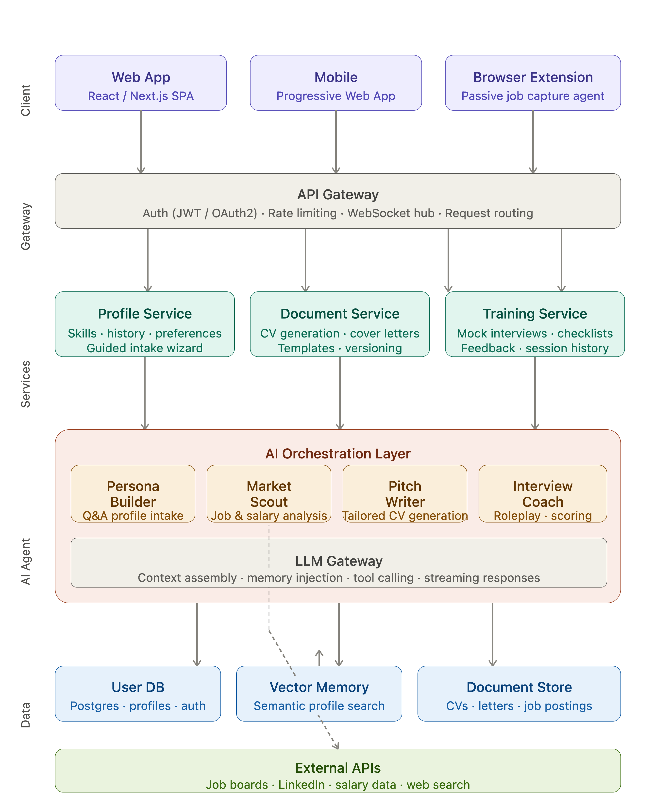

I need to design architecture for a web app : seeking for a job or preparing application, CV, training for interview requires a lot of effort. Idea is to summarize and help by building personal trainier who does this. It can preserve your data as a generic profile and help pitching for a new position on a today dynamic labour market. It can train with you and go through check lists.

## What it does
1. Captures basic data like
- Basic details
- Asks question to build main profile desc
- Collect your skills
- Memorize details for future CVs and applications
- Does market analysis for you
- Works as an agent and captures interesting details if you allow him
## How we built it
- Web application
- Creates login and profile
- Interacts with AI
- Stores memory

## Design

Here's a layered architecture designed around the user journey — from profile capture to AI agent assistance.Click any block to drill in. Here's the rationale for each layer:

**Client layer** has three surfaces: the main SPA for guided profile work, a PWA for mobile access, and a browser extension that passively captures job postings as the user browses — this is the "agent captures interesting details" feature you described, with explicit user permission.

**API Gateway** is a single entry point handling JWT/OAuth authentication, WebSocket connections (for streaming AI responses), and routing. This keeps auth logic in one place rather than scattered across services.

**Core Services** are split into three clear domains: Profile (intake, skills, history), Documents (CV generation, templates, versioning), and Training (mock interviews, checklists, session scoring). Each can be a separate microservice or a module within a monolith early on — start as a monolith and extract only when load demands it.

**AI Orchestration Layer** is the heart of the app. Four specialized sub-agents share a common LLM gateway:

- **Persona Builder** — conversational Q&A to build the user's profile narrative
- **Market Scout** — pulls job board data, salary benchmarks, company intel
- **Pitch Writer** — takes a job posting + user profile and generates a tailored CV/cover letter
- **Interview Coach** — roleplays as an interviewer, scores answers, gives feedback

The LLM gateway handles context assembly (what slice of the user's profile to inject), memory management, tool calling, and streaming.

**Data layer** uses three stores: a relational DB (Postgres) for structured user data and auth, a vector store (Pinecone or pgvector) for semantic profile retrieval so the LLM can find the most relevant experience snippets, and a document store (S3 + metadata DB) for CVs and saved job postings.

**Suggested tech stack for a first version:** Next.js frontend + FastAPI or Node backend + Postgres + pgvector (avoids a separate vector DB) + OpenAI or Anthropic API + Supabase for auth (reduces boilerplate significantly). The browser extension can start as a simple bookmarklet that sends a URL to the Market Scout.

## Frontend specs

[FrontEnd Details ](FRONTEND.md).

