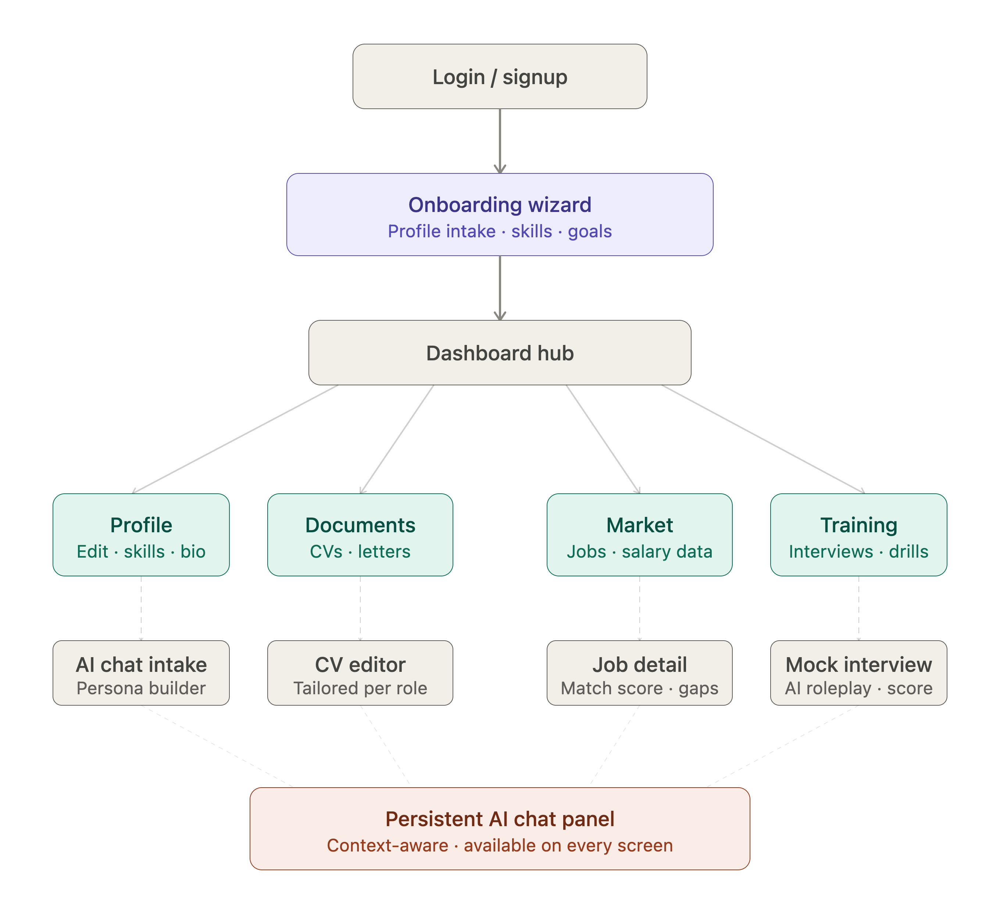
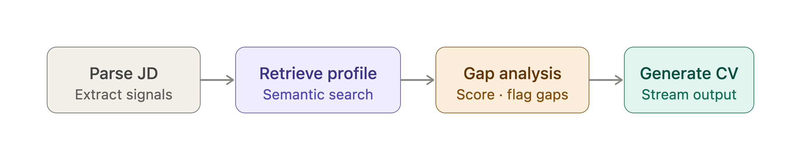
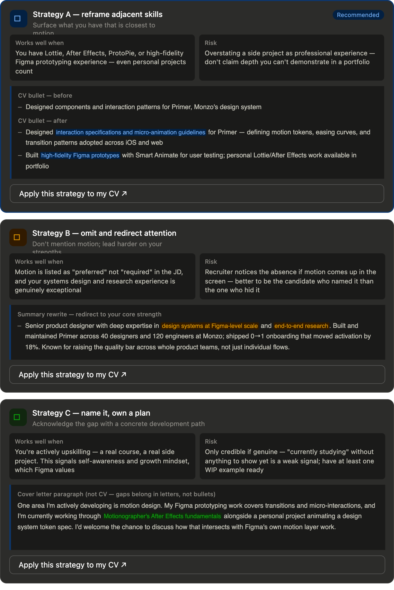

## Design

Here's a layered architecture designed around the user journey — from profile capture to AI agent assistance.Click any block to drill in. Here's the rationale for each layer:

**Client layer** has three surfaces: the main SPA for guided profile work, a PWA for mobile access, and a browser extension that passively captures job postings as the user browses — this is the "agent captures interesting details" feature you described, with explicit user permission.

**API Gateway** is a single entry point handling JWT/OAuth authentication, WebSocket connections (for streaming AI responses), and routing. This keeps auth logic in one place rather than scattered across services.

**Core Services** are split into three clear domains: Profile (intake, skills, history), Documents (CV generation, templates, versioning), and Training (mock interviews, checklists, session scoring). Each can be a separate microservice or a module within a monolith early on — start as a monolith and extract only when load demands it.

**AI Orchestration Layer** is the heart of the app. Four specialized sub-agents share a common LLM gateway:

- **Persona Builder** — conversational Q&A to build the user's profile narrative
- **Market Scout** — pulls job board data, salary benchmarks, company intel
- **Pitch Writer** — takes a job posting + user profile and generates a tailored CV/cover letter
- **Interview Coach** — roleplays as an interviewer, scores answers, gives feedback

## Frontend specs

## Example : How would you tailor a CV for the Figma Senior Product Designer role?

Great question — this is exactly what the Pitch Writer agent does. Let me walk through the full pipeline, then show you what the CV tailoring screen would look like in the app.

The process has four stages:

Here's what happens at each stage, and then what the actual UI screen looks like.
Stage 1 — Parse the JD. The agent strips the Figma job description down to structured signals: required skills, preferred skills, seniority cues, company values language, and role-specific keywords ("systems thinking", "cross-functional", "0→1"). This is done with a targeted LLM call using a strict extraction prompt, outputting JSON.
Stage 2 — Retrieve profile snippets. Rather than dumping the user's entire profile into the prompt, the agent runs a semantic search against the vector store — finding the 5–8 most relevant experience bullets, projects, and skills for this specific role. A Figma role pulls design system work and cross-functional leadership examples; a startup role pulls "0→1" and velocity examples from the same profile.
Stage 3 — Gap analysis. The agent compares extracted JD signals against retrieved profile snippets and produces a scored diff: strong matches get surfaced prominently; gaps get flagged so the user can decide whether to acknowledge them, reframe adjacent skills, or just omit.
Stage 4 — Generate and stream. The tailored CV is written section by section — summary first (rewritten to mirror Figma's language), then experience bullets reordered and rephrased to lead with the most relevant achievements. The output streams token-by-token into the editor so the user sees it being written in real time.
Here's what the actual CV tailoring screen looks like — a split-pane editor where the AI writes on the right while the match analysis stays visible on the left:

A few things worth unpacking about how the agent should reason through this:
Strategy A is the recommended default because Figma's JD almost certainly isn't asking for a dedicated motion designer — they want a senior product designer who can speak motion fluently and write credible specs for it. "Motion" in that context means: do your interaction specs include easing curves, do your Figma prototypes use Smart Animate, do you know when to reach for a Lottie file vs a CSS transition? Most strong product designers already do this without labelling it "motion experience." The agent's job is to find those moments in the profile and give them the right name.
Strategy C is the most honest and often the most impressive — but only if it's real. A concrete course name, a specific side project in progress, or a portfolio piece that's 70% done is the difference between "I'm aware of my gaps and actively working on them" (which senior hiring managers love) and "I listed a gap and hoped for the best." The agent should check the profile for any learning signals before offering this strategy — if there's nothing there, it should say so.
One important UX note for the app: gaps should never just be silently ignored or silently fixed. The agent showing its work — explaining which strategy it applied and why — is what separates this from a basic AI CV rewriter. It makes the output auditable and keeps the user in control of how they want to present themselves.
