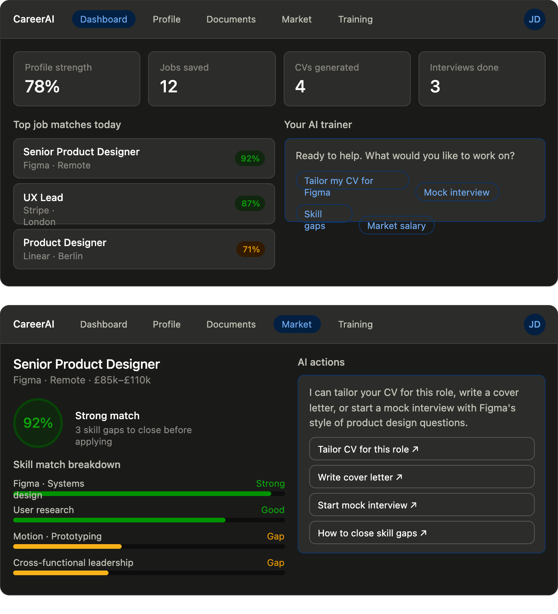

## Web App frontend layer

the frontend is where users spend all their time, so it deserves real depth. Here's how I'd break it down across structure, screens, and the component architecture.

**Technology stack**: Next.js 14+ (App Router) is the right choice — you get SSR for the public-facing pages (landing, login), and client-side SPA behavior for the authenticated app. TypeScript throughout. Tailwind for styling. Zustand or Jotai for lightweight client state. React Query / TanStack Query for all server data.
**Key screens and their roles**:
The first diagram shows how all the screens relate to each other:


The most important design decision here is the persistent AI chat panel — it lives in a side-drawer or bottom sheet across all screens, so the user can ask the AI anything in context ("make me a CV for this job", "quiz me on this role") without losing where they are.
Now here's what the dashboard and a key screen (the job detail with match score) actually look like:



A few important frontend design decisions worth calling out:

The AI panel is ambient, not modal. Rather than a popup that hijacks the screen, the AI trainer lives in a persistent right-side panel (collapsible on mobile). It's always context-aware — when you're on the job detail screen, it already knows which job you're looking at. This avoids the friction of re-explaining context every time.

Match scoring drives the UX. The skill gap bars on the job detail are the core value proposition made visual — the user should immediately see what they have and what's missing. The AI actions below are directly tied to those gaps ("how to close skill gaps"), which makes the AI feel purposeful rather than generic.

Component architecture — organized by feature, not by type:
```
src/
  features/
    profile/        ← ProfileCard, SkillsGrid, IntakeWizard
    documents/      ← CVEditor, CoverLetterBuilder, TemplateGallery
    market/         ← JobCard, JobDetail, MatchScore, SalaryBenchmark
    training/       ← MockInterview, ChecklistView, SessionHistory
    ai-panel/       ← ChatPanel, SuggestedActions, StreamingMessage
  components/
    ui/             ← Button, Card, Badge, ProgressBar (shared primitives)
  lib/
    api/            ← React Query hooks (useProfile, useJobs, useSession)
    auth/           ← useAuth, session management
    streaming/      ← SSE / WebSocket hook for AI responses
```
The streaming hook is worth building carefully from the start. AI responses stream token-by-token, so you need a `useStreamingMessage` hook that handles the SSE connection, accumulates the text, and handles errors and reconnects gracefully.
Mobile strategy: Build as a responsive SPA first. The interview coaching and AI chat flows work very naturally on mobile (they're conversational). The CV editor and market analysis sections need more horizontal space, so on mobile those collapse to read-only views with an "edit on desktop" prompt.


The LLM gateway handles context assembly (what slice of the user's profile to inject), memory management, tool calling, and streaming.


